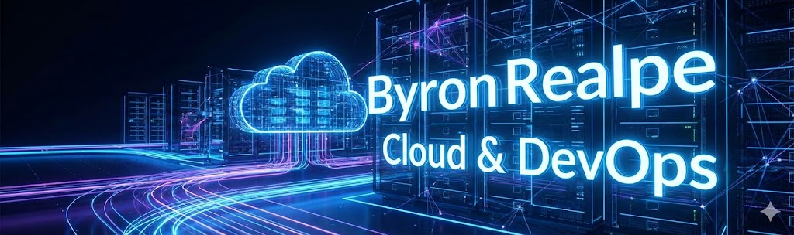

# Hola, soy Byron Realpe 👋
## 🚀 Azure DevOps Engineer | Especialista en Automatización con IA

---

### 💡 Sobre Mí: La Evolución del DevOps

Soy un ingeniero DevOps especializado en el ecosistema **Azure**, con un enfoque único: **la integración de Inteligencia Artificial Generativa en los flujos de trabajo de infraestructura**.

No solo construyo pipelines; **optimizo el tiempo de creación de los mismos**. Utilizo ingeniería de prompts avanzada para acelerar el desarrollo de scripts, configuraciones de IaC y soluciones de automatización, logrando reducir drásticamente los tiempos de entrega sin sacrificar la seguridad o la calidad.

> *"Mi objetivo no es solo automatizar tareas, sino automatizar la creación de la automatización misma."*

---

### 🧠 AI-Ops: Ingeniería de Prompts en Acción
*(Esta sección destaca mi diferencial técnico)*

He desarrollado una metodología de "Prompt Engineering" para DevOps que me permite generar infraestructura como código (IaC) precisa y segura en tiempo récord.

⚡ <b>Haz clic para ver un ejemplo de mi flujo de trabajo</b>

 

**Escenario:** Necesidad urgente de un módulo Bicep para AKS con monitoreo habilitado.

**1. Mi Prompt Técnico (Extracto):**
> "Actúa como Senior Azure DevOps Engineer. Genera un módulo de Bicep para desplegar un clúster AKS. Requisitos estrictos:
> - Integración con Azure Monitor y Log Analytics (usando workspace ID existente).
> - RBAC habilitado con integración de AAD.
> - Network plugin: Azure CNI.
> - Output: Resource ID y Principal ID del cluster.
> - Validar cumplimiento de política CIS Benchmark."

**2. Resultado:**
Generación de código validado y listo para deploy en **< 5 minutos**, reduciendo el tiempo de desarrollo manual de 2 horas a minutos.

---

### 🛠️ Tech Stack & Habilidades

#### ☁️ Cloud & Infraestructura
   

* **IaC:** ARM Templates, Bicep, Terraform.
* **Contenedores:** Despliegue y escalado en **AKS (Azure Kubernetes Service)**.
* **Serverless & Compute:** Azure Functions, Web Apps, VM Scale Sets.

#### 🔄 CI/CD & Automatización
  

* Diseño de Pipelines complejos (YAML/Classic).
* Estrategias de Branching (GitFlow) y Gobernanza.
* Release Management automatizado.

#### 🛢️ Bases de Datos & Seguridad
 

* **Database DevOps:** Implementación de CI/CD para SQL Server (Redgate, DACPAC).
* **DevSecOps:** Análisis estático (SonarCloud) y escaneo de vulnerabilidades.

---

### 📈 Proyectos Destacados

| Proyecto | Descripción | Tech Stack |
| :--- | :--- | :--- |
| **Automatización AKS** | Despliegue Zero-Touch de clústeres Kubernetes con observabilidad integrada. | Azure DevOps, Bicep, Prometheus |
| **DB Release Pipeline** | Pipeline seguro para migración de esquemas SQL Server en producción. | Redgate, SQL Toolbelt, PowerShell |
| **AI Prompt Library** | Librería interna de prompts para generación rápida de templates ARM/Terraform. | GPT-4, Python, Git |

---

### 📫 Contacto

Estoy siempre abierto a discutir nuevos retos o compartir conocimientos sobre DevOps e IA.

* 💼 [LinkedIn](https://www.linkedin.com/in/byron-realpe-65a836110)
* 🐙 [GitHub](https://github.com/ByronAnto)
